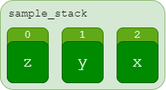

# Stacks

## Overview

A **stack** is a simple data structure with many useful applications. They hold data in a one-dimensional array using a **last-in-first-out** (LIFO) approach. This means that elements added to the stack last will be the first to be removed. Conversely, the first element added to a stack will be removed last. In other words, the only way to remove a given element from a stack is to first remove all elements that were added after it. This concept will be explored further below.

In python, there is no special data type for stacks - we can simply use lists to represent them.

```python
sample_stack = ['z', 'y', 'x']
```



## Regular Operations

Stacks' operations are more restricted than lists. While you can add values to the beginning of a dynamic array, you can only add and remove elements from the end of a stack.

Stacks are different from most data structures in that they have only a single access point for regular read/add/remove data operations. To insert a new element, we **push** to the back of the stack. To remove the topmost element, we **pop** from the back of the stack. The back, therefore is the singular point of access to the data structure.

### Push

In python, we can push an element onto a stack with the simple `append()` function.

```python
sample_stack.append('w')
```


> **Note**: while, in Python, you could perform other operations to add data to this list, such as `.insert()` or simply accessing an index like `sample_stack[1] = "Y"` to alter data, this defeats the purpose of a stack. Not only does this ruin the integrity of the data structure, it also means we lose the performance benefit stacks have over lists (we'll talk about this more later). So basically, even though you *could*, don't.

### Pop

> ### *"POP, POP!"*

#### *- Magnitude, Community (multiple occasions)*

Similarly, we can remove values from the stack with a simple function on the list. This time, it's actually named appropriately: `pop()`. This function will not just remove the last element in the stack; it will return its value to the calling expression.

```python
last_value = sample_stack.pop()
```


## Example Use Cases

> **Note to instructor or whoever's grading this**: I plan to finish these sections eventually. But this is just a draft and I'm late with it, so I gotta turn something in.

I dunno, maybe I'll use a maze problem? Like use a stack to keep track of the moves you make in a maze? Or was that already one of our assignments this semester? That'd be awkward. Also that might be kinda hard. I'll bet many people end up using the exact same ideas to demonstrate uses of some of these data structures.

## Exercise Problem

Alright now go and use a python stack to represent a stack of waffles because that's totally different from a stack of pancakes...
