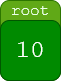
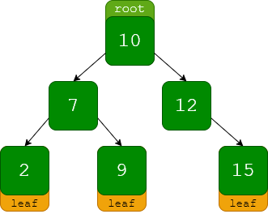
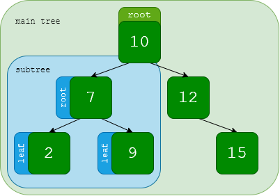
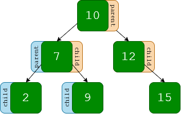

# Trees

## Overview

A tree is a data structure wherein elements are linked to one another such that all links can lead back to a single source. When represented visually, it can resemble an upside-down tree, hence the name. Unlike the other two data structures we have looked at thus far, there are several kinds of trees.

## (t)Re(e)lationships

To understand the basic structure of trees, let's look at the smallest example of one:

This tree contains only a single element: the number 10. In this case, 10 is the **root** node. This is the single source to which all elements within a tree lead back. Let's look at a bigger example.

### Subtrees

### Roots & Leaves

### Parents & Children

## Recursion

## Regular Operations

### Read

### Insert

### Update

### Delete

## Example Use Case

## Exercise Problem
